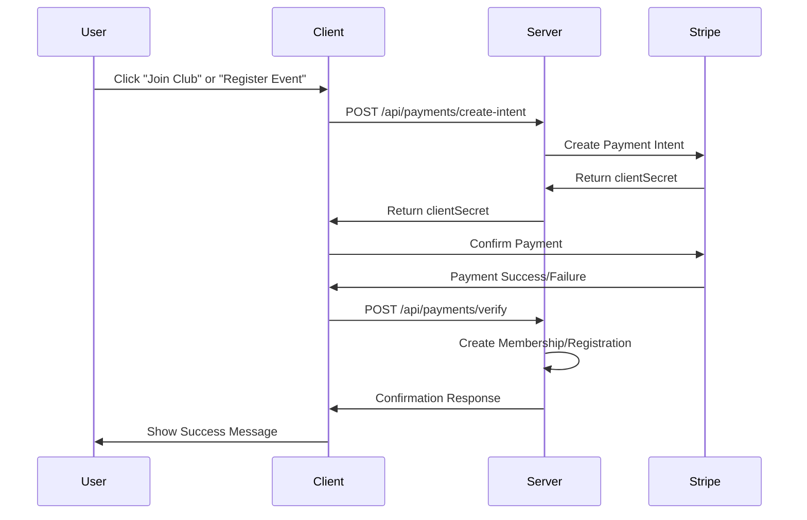

# 🎯 ClubSphere - Membership & Event Management Platform

<div align="center">


**Discover, Join, and Manage Local Clubs with Ease**

[](https://club-sphere-client-five.vercel.app)
[](https://club-sphere-server-ashy.vercel.app)
[](LICENSE)

</div>

---

## 📑 Table of Contents

- [Project Overview](#-project-overview)
- [Purpose](#-purpose)
- [Live URLs](#-live-urls)
- [Key Features](#-key-features)
- [Technology Stack](#️-technology-stack)
- [Admin Credentials](#-admin-credentials)
- [Installation Guide](#-installation-guide)
- [Environment Variables](#️-environment-variables)
- [API Documentation](#-api-documentation)
- [User Roles & Permissions](#-user-roles--permissions)
- [Database Schema](#-database-schema)
- [Payment Integration](#-payment-integration)
- [Project Structure](#-project-structure)
- [Screenshots](#-screenshots)
- [Contributing](#-contributing)
- [License](#-license)
- [Contact](#-contact)

---

## 🌟 Project Overview

**ClubSphere** is a comprehensive full-stack MERN application designed to help people discover, join, and manage local clubs such as photography clubs, hiking groups, book clubs, and tech communities. The platform provides a seamless experience for club managers to create and manage clubs and events, while members can join clubs, pay membership fees, and register for events. An admin oversees the entire platform with powerful monitoring and management tools.

### Project Theme

A modern web application for managing local clubs and their activities, featuring secure authentication, role-based access control, integrated payment processing, and real-time data management.

---

## 🎯 Purpose

The main purpose of ClubSphere is to:

- **Connect Communities**: Help people find and join local clubs based on their interests
- **Simplify Management**: Provide club managers with tools to efficiently manage clubs and events
- **Secure Payments**: Enable safe and secure membership and event fee collection via Stripe
- **Centralized Control**: Give admins comprehensive oversight of the entire platform
- **Enhance Engagement**: Foster active participation through event management and member interactions

---

## 🔗 Live URLs

### 🌐 Client Application
**Live Site**: [https://club-sphere-client-five.vercel.app](https://club-sphere-client-five.vercel.app)

### 🖥️ Server API
**API Base URL**: [https://club-sphere-server-ashy.vercel.app](https://club-sphere-server-ashy.vercel.app)

### 📂 GitHub Repositories
- **Client Repository**: [https://github.com/mdzahidulislam-dev/ClubSphere-Client](https://github.com/mdzahidulislam-dev/ClubSphere-Client)
- **Server Repository**: [https://github.com/mdzahidulislam-dev/ClubSphere-Server](https://github.com/mdzahidulislam-dev/ClubSphere-Server)

---

## ✨ Key Features

### 🔐 Authentication & Authorization

- **Multi-Provider Authentication**
  - Email/Password authentication via Firebase
  - Google OAuth integration
  - Secure JWT token-based session management
  - Password validation (uppercase, lowercase, minimum 6 characters)
  - Firebase token verification on protected routes

### 👥 Role-Based Access Control (RBAC)

**Three Distinct User Roles:**

1. **Admin**
   - Monitor platform statistics and analytics
   - Approve/reject club registration requests
   - Promote/demote users between roles
   - View all payments and transactions
   - Manage all users on the platform
   - Full access to clubs and events management

2. **Club Manager**
   - Create and manage multiple clubs
   - Set membership fees (free or paid)
   - Create and manage club events
   - View and manage club members
   - Track event registrations
   - Access club-specific revenue reports

3. **Member**
   - Browse and search clubs by category
   - Join clubs (with or without membership fee)
   - Register for club events
   - View membership and payment history
   - Manage event registrations
   - Access personalized dashboard

### 🎪 Club Management

- **Complete CRUD Operations**
  - Create clubs with detailed information
  - Upload club banner images
  - Set club categories (Photography, Sports, Tech, etc.)
  - Define membership fees or offer free membership
  - Update club details and settings
  - Club approval workflow (pending → approved/rejected)

- **Club Features**
  - Location-based club organization
  - Category filtering and search
  - Member count tracking
  - Club status management
  - Manager assignment and control

### 📅 Event Management

- **Full Event Lifecycle**
  - Create events for approved clubs
  - Set event dates and locations
  - Configure paid or free events
  - Set maximum attendee limits
  - Event registration system
  - Real-time attendee tracking

- **Event Features**
  - Event categorization
  - Date-based sorting
  - Registration status tracking
  - Payment integration for paid events
  - Event cancellation management

### 💳 Stripe Payment Integration

- **Secure Payment Processing**
  - Test mode integration with Stripe
  - Membership fee payment handling
  - Event registration fee collection
  - Payment intent creation
  - Transaction status tracking
  - Payment history for users

- **Payment Features**
  - Free and paid membership options
  - Free and paid event options
  - Secure payment confirmation
  - Transaction records
  - Revenue tracking for managers
  - Admin payment monitoring

### 🔍 Advanced Search & Filter

- **Server-Side Implementation**
  - Search clubs by name
  - Filter by club category
  - Filter by location
  - Sort clubs (newest, oldest, highest fee, lowest fee)
  - Sort events by date
  - Real-time search results

### 📊 Dynamic Dashboards

- **Admin Dashboard**
  - Total users count
  - Total clubs statistics (pending/approved/rejected)
  - Total memberships overview
  - Total events count
  - Revenue analytics with charts
  - User role management interface
  - Club approval system
  - Payment transaction viewer

- **Club Manager Dashboard**
  - Managed clubs overview
  - Total members across clubs
  - Events created count
  - Revenue received
  - Club member management
  - Event registration viewer
  - CRUD operations for clubs and events

- **Member Dashboard**
  - Active memberships display
  - Registered events list
  - Upcoming events calendar
  - Payment history
  - Quick stats overview

### 🎨 Modern UI/UX

- **Framer Motion Animations**
  - Hero section animations
  - Card appearance effects
  - Scroll-based animations
  - Smooth page transitions

- **Responsive Design**
  - Mobile-first approach
  - Tablet optimization
  - Desktop full-width layouts
  - Collapsible navigation for small screens

- **Consistent Design System**
  - Uniform color scheme
  - Consistent typography
  - Standardized button styles
  - Equal-sized cards and images
  - Proper spacing and alignment

### 🛡️ Security Features

- **Backend Security**
  - Firebase token verification middleware
  - Role-based route protection
  - Secure environment variables
  - Password hashing
  - Protected API endpoints

- **Frontend Security**
  - Private route implementation
  - Auth state persistence on reload
  - Secure token storage
  - Authorized domain configuration

### 📱 Additional Features

- Loading states with spinners/skeletons
- Toast notifications for user actions
- Form validation with React Hook Form
- Error handling with custom 404 page
- TanStack Query for efficient data fetching
- Optimistic UI updates
- Data caching and refetching strategies

---

## 🛠️ Technology Stack

### Frontend Technologies

| Technology | Purpose | Version |
|-----------|---------|---------|
| **React.js** | UI Library | ^18.3.1 |
| **React Router DOM** | Client-side Routing | ^7.1.1 |
| **Tailwind CSS** | Utility-first CSS Framework | ^3.4.17 |
| **DaisyUI** | Tailwind Component Library | ^4.12.23 |
| **TanStack Query** | Data Fetching & State Management | ^5.62.11 |
| **React Hook Form** | Form Management | ^7.54.2 |
| **Firebase** | Authentication | ^11.1.0 |
| **Axios** | HTTP Client | ^1.7.9 |
| **Framer Motion** | Animation Library | ^11.15.0 |
| **React Icons** | Icon Library | ^5.4.0 |
| **Stripe.js** | Payment Processing | ^4.11.0 |
| **React Toastify** | Toast Notifications | ^10.0.6 |
| **Swiper** | Touch Slider | ^11.1.15 |
| **Lottie React** | Animation Player | ^2.4.0 |
| **React Fast Marquee** | Marquee Component | ^1.6.5 |

### Backend Technologies

| Technology | Purpose | Version |
|-----------|---------|---------|
| **Node.js** | Runtime Environment | ^20.x |
| **Express.js** | Web Framework | ^4.21.2 |
| **MongoDB** | NoSQL Database | ^6.12.0 |
| **Mongoose** | MongoDB ODM | - |
| **Firebase Admin** | Token Verification | ^13.0.2 |
| **Stripe** | Payment Gateway | ^17.5.0 |
| **JWT** | JSON Web Tokens | ^9.0.2 |
| **Bcrypt** | Password Hashing | - |
| **Cors** | Cross-Origin Resource Sharing | ^2.8.5 |
| **Dotenv** | Environment Variables | ^16.4.7 |
| **Nodemailer** | Email Service | - |

### Development Tools

- **Vite** - Build Tool
- **ESLint** - Code Linting
- **PostCSS** - CSS Processing
- **Autoprefixer** - CSS Vendor Prefixing

### Deployment & Hosting

- **Vercel** - Frontend & Backend Hosting
- **MongoDB Atlas** - Database Hosting
- **Firebase** - Authentication Service
- **Stripe** - Payment Processing (Test Mode)

---

## 🔑 Admin Credentials

For testing and evaluation purposes:

```
Admin Email: admin@clubsphere.com
Admin Password: Admin@123
```

**Note**: Please use these credentials responsibly for testing purposes only.

---

## 📦 Installation Guide

### Prerequisites

Before you begin, ensure you have the following installed:

- **Node.js** (v16.x or higher)
- **npm** or **yarn**
- **MongoDB** (local or Atlas account)
- **Git**
- **Firebase Account**
- **Stripe Account** (Test Mode)

### Client Installation

```bash
# Clone the client repository
git clone https://github.com/mdzahidulislam-dev/ClubSphere-Client.git

# Navigate to the project directory
cd ClubSphere-Client

# Install dependencies
npm install

# Create environment variables file
touch .env.local

# Start development server
npm run dev
```

The client will run on `http://localhost:5173`

### Server Installation

```bash
# Clone the server repository
git clone https://github.com/mdzahidulislam-dev/ClubSphere-Server.git

# Navigate to the project directory
cd ClubSphere-Server

# Install dependencies
npm install

# Create environment variables file
touch .env

# Start development server
npm start
```

The server will run on `http://localhost:5000`

---

## ⚙️ Environment Variables

### Client Environment Variables

Create a `.env.local` file in the client root directory:

```env
# Vite API Configuration
VITE_API_URL=http://localhost:5000

# Firebase Configuration
VITE_FIREBASE_API_KEY=your_firebase_api_key
VITE_FIREBASE_AUTH_DOMAIN=your_project_id.firebaseapp.com
VITE_FIREBASE_PROJECT_ID=your_project_id
VITE_FIREBASE_STORAGE_BUCKET=your_project_id.appspot.com
VITE_FIREBASE_MESSAGING_SENDER_ID=your_messaging_sender_id
VITE_FIREBASE_APP_ID=your_app_id

# Stripe Configuration
VITE_STRIPE_PUBLIC_KEY=your_stripe_publishable_key

# Image Upload (Optional)
VITE_IMGBB_API_KEY=your_imgbb_api_key
```

### Server Environment Variables

Create a `.env` file in the server root directory:

```env
# Server Configuration
PORT=5000
NODE_ENV=development

# MongoDB Configuration
MONGODB_URI=your_mongodb_connection_string

# JWT Configuration
JWT_SECRET=your_jwt_secret_key
JWT_EXPIRES_IN=7d

# Firebase Admin SDK
FIREBASE_PROJECT_ID=your_project_id
FIREBASE_PRIVATE_KEY=your_private_key
FIREBASE_CLIENT_EMAIL=your_client_email

# Stripe Configuration
STRIPE_SECRET_KEY=your_stripe_secret_key
STRIPE_WEBHOOK_SECRET=your_webhook_secret

# Email Configuration (Optional)
EMAIL_HOST=smtp.gmail.com
EMAIL_PORT=587
EMAIL_USER=your_email@gmail.com
EMAIL_PASSWORD=your_email_app_password

# Client URL
CLIENT_URL=http://localhost:5173

# Allowed Origins for CORS
ALLOWED_ORIGINS=http://localhost:5173,https://club-sphere-client-five.vercel.app
```

### Firebase Setup

1. Go to [Firebase Console](https://console.firebase.google.com/)
2. Create a new project
3. Enable Authentication → Email/Password and Google providers
4. Add your deployment domain to authorized domains
5. Download service account key for admin SDK (server-side)
6. Copy configuration to environment variables

### Stripe Setup

1. Go to [Stripe Dashboard](https://dashboard.stripe.com/)
2. Toggle to Test Mode
3. Get your Publishable Key and Secret Key
4. Add keys to environment variables

### MongoDB Setup

1. Create account on [MongoDB Atlas](https://www.mongodb.com/cloud/atlas)
2. Create a new cluster
3. Create database user
4. Whitelist IP addresses (0.0.0.0/0 for development)
5. Get connection string and add to environment variables

---

## 📡 API Documentation

### Base URL

```
Production: https://club-sphere-server-ashy.vercel.app
Development: http://localhost:5000
```

### Authentication Endpoints

#### Register User
```http
POST /api/auth/register
Content-Type: application/json

{
  "name": "John Doe",
  "email": "john@example.com",
  "password": "Password123",
  "photoURL": "https://example.com/photo.jpg"
}
```

#### Login User
```http
POST /api/auth/login
Content-Type: application/json

{
  "email": "john@example.com",
  "password": "Password123"
}
```

#### Google Login
```http
POST /api/auth/google
Content-Type: application/json
Authorization: Bearer <firebase_token>

{
  "name": "John Doe",
  "email": "john@example.com",
  "photoURL": "https://example.com/photo.jpg"
}
```

#### Get User Profile
```http
GET /api/auth/profile
Authorization: Bearer <firebase_token>
```

### Club Endpoints

#### Get All Clubs
```http
GET /api/clubs?search=photography&category=Arts&sort=newest
```

#### Get Club by ID
```http
GET /api/clubs/:clubId
```

#### Create Club (Club Manager)
```http
POST /api/clubs
Authorization: Bearer <firebase_token>
Content-Type: application/json

{
  "clubName": "Photography Club",
  "description": "A club for photography enthusiasts",
  "category": "Photography",
  "location": "Dhaka",
  "bannerImage": "https://example.com/banner.jpg",
  "membershipFee": 500
}
```

#### Update Club (Club Manager)
```http
PUT /api/clubs/:clubId
Authorization: Bearer <firebase_token>
Content-Type: application/json

{
  "clubName": "Updated Club Name",
  "description": "Updated description"
}
```

#### Approve/Reject Club (Admin)
```http
PATCH /api/clubs/:clubId/status
Authorization: Bearer <firebase_token>
Content-Type: application/json

{
  "status": "approved"
}
```

### Membership Endpoints

#### Join Club
```http
POST /api/memberships/join
Authorization: Bearer <firebase_token>
Content-Type: application/json

{
  "clubId": "club_id_here",
  "paymentIntentId": "pi_xxxxx" // if paid membership
}
```

#### Get User Memberships
```http
GET /api/memberships/my-memberships
Authorization: Bearer <firebase_token>
```

#### Get Club Members (Manager)
```http
GET /api/memberships/club/:clubId/members
Authorization: Bearer <firebase_token>
```

### Event Endpoints

#### Get All Events
```http
GET /api/events?clubId=xxx&sort=date
```

#### Get Event by ID
```http
GET /api/events/:eventId
```

#### Create Event (Club Manager)
```http
POST /api/events
Authorization: Bearer <firebase_token>
Content-Type: application/json

{
  "clubId": "club_id_here",
  "title": "Photography Workshop",
  "description": "Learn professional photography",
  "eventDate": "2024-12-25",
  "location": "Dhaka",
  "isPaid": true,
  "eventFee": 300,
  "maxAttendees": 50
}
```

#### Update Event (Club Manager)
```http
PUT /api/events/:eventId
Authorization: Bearer <firebase_token>
```

#### Delete Event (Club Manager)
```http
DELETE /api/events/:eventId
Authorization: Bearer <firebase_token>
```

### Event Registration Endpoints

#### Register for Event
```http
POST /api/event-registrations/register
Authorization: Bearer <firebase_token>
Content-Type: application/json

{
  "eventId": "event_id_here",
  "paymentIntentId": "pi_xxxxx" // if paid event
}
```

#### Get User Registrations
```http
GET /api/event-registrations/my-registrations
Authorization: Bearer <firebase_token>
```

#### Get Event Attendees (Manager)
```http
GET /api/event-registrations/event/:eventId/attendees
Authorization: Bearer <firebase_token>
```

### Payment Endpoints

#### Create Payment Intent
```http
POST /api/payments/create-intent
Authorization: Bearer <firebase_token>
Content-Type: application/json

{
  "amount": 500,
  "type": "membership", // or "event"
  "clubId": "club_id_here"
}
```

#### Verify Payment
```http
POST /api/payments/verify
Authorization: Bearer <firebase_token>
Content-Type: application/json

{
  "paymentIntentId": "pi_xxxxx"
}
```

#### Get Payment History
```http
GET /api/payments/history
Authorization: Bearer <firebase_token>
```

### Admin Endpoints

#### Get All Users
```http
GET /api/admin/users
Authorization: Bearer <firebase_token>
```

#### Update User Role
```http
PATCH /api/admin/users/:userId/role
Authorization: Bearer <firebase_token>
Content-Type: application/json

{
  "role": "clubManager"
}
```

#### Get Platform Statistics
```http
GET /api/admin/statistics
Authorization: Bearer <firebase_token>
```

---

## 👥 User Roles & Permissions

### Role Hierarchy

```
Admin → Club Manager → Member → Guest
```

### Permission Matrix

| Feature | Admin | Club Manager | Member | Guest |
|---------|-------|--------------|--------|-------|
| **Clubs** |
| View all clubs | ✅ | ✅ | ✅ | ✅ |
| View club details | ✅ | ✅ | ✅ | ✅ |
| Create club | ✅ | ✅ | ❌ | ❌ |
| Edit own club | ✅ | ✅ | ❌ | ❌ |
| Delete club | ✅ | ❌ | ❌ | ❌ |
| Approve/Reject club | ✅ | ❌ | ❌ | ❌ |
| Join club | ✅ | ✅ | ✅ | ❌ |
| View club members | ✅ | ✅ (own) | ❌ | ❌ |
| **Events** |
| View all events | ✅ | ✅ | ✅ | ✅ |
| Create event | ✅ | ✅ (own club) | ❌ | ❌ |
| Edit event | ✅ | ✅ (own) | ❌ | ❌ |
| Delete event | ✅ | ✅ (own) | ❌ | ❌ |
| Register for event | ✅ | ✅ | ✅ | ❌ |
| View attendees | ✅ | ✅ (own) | ❌ | ❌ |
| **Users** |
| View all users | ✅ | ❌ | ❌ | ❌ |
| Change user role | ✅ | ❌ | ❌ | ❌ |
| **Payments** |
| View all payments | ✅ | ❌ | ❌ | ❌ |
| View own payments | ✅ | ✅ | ✅ | ❌ |
| View club revenue | ✅ | ✅ (own) | ❌ | ❌ |
| **Dashboard** |
| Access admin dashboard | ✅ | ❌ | ❌ | ❌ |
| Access manager dashboard | ✅ | ✅ | ❌ | ❌ |
| Access member dashboard | ✅ | ✅ | ✅ | ❌ |

---

## 🗄️ Database Schema

### Users Collection

```javascript
{
  _id: ObjectId,
  name: String,
  email: String (unique),
  photoURL: String,
  role: String (enum: ['admin', 'clubManager', 'member']),
  createdAt: Date,
  updatedAt: Date
}
```

### Clubs Collection

```javascript
{
  _id: ObjectId,
  clubName: String,
  description: String,
  category: String (e.g., "Photography", "Sports", "Tech"),
  location: String,
  bannerImage: String,
  membershipFee: Number (0 for free),
  status: String (enum: ['pending', 'approved', 'rejected']),
  managerEmail: String (FK → users.email),
  createdAt: Date,
  updatedAt: Date
}
```

### Memberships Collection

```javascript
{
  _id: ObjectId,
  userEmail: String (FK → users.email),
  clubId: ObjectId (FK → clubs._id),
  status: String (enum: ['active', 'expired', 'pendingPayment']),
  paymentId: String (reference to payment),
  joinedAt: Date,
  expiresAt: Date (optional)
}
```

### Events Collection

```javascript
{
  _id: ObjectId,
  clubId: ObjectId (FK → clubs._id),
  title: String,
  description: String,
  eventDate: Date,
  location: String,
  isPaid: Boolean,
  eventFee: Number (if isPaid),
  maxAttendees: Number (optional),
  createdAt: Date,
  updatedAt: Date
}
```

### Event Registrations Collection

```javascript
{
  _id: ObjectId,
  eventId: ObjectId (FK → events._id),
  userEmail: String (FK → users.email),
  clubId: ObjectId (FK → clubs._id),
  status: String (enum: ['registered', 'cancelled']),
  paymentId: String (optional, if event is paid),
  registeredAt: Date
}
```

### Payments Collection

```javascript
{
  _id: ObjectId,
  userEmail: String (FK → users.email),
  amount: Number,
  type: String (enum: ['membership', 'event']),
  clubId: ObjectId (optional),
  eventId: ObjectId (optional),
  stripePaymentIntentId: String,
  status: String (enum: ['pending', 'completed', 'failed', 'refunded']),
  createdAt: Date
}
```

---

## 💰 Payment Integration

### Stripe Integration Flow



### Payment Testing

Use these test card numbers in Stripe test mode:

| Card Number | Scenario |
|------------|----------|
| 4242 4242 4242 4242 | Success |
| 4000 0000 0000 9995 | Decline |
| 4000 0027 6000 3184 | 3D Secure Required |

**Test Card Details:**
- **Expiry Date**: Any future date
- **CVC**: Any 3 digits
- **ZIP**: Any 5 digits

### Payment Features Implemented

1. **Membership Payments**
   - Create payment intent for membership fee
   - Handle payment confirmation
   - Create membership record on success
   - Update payment status

2. **Event Payments**
   - Create payment intent for event fee
   - Handle registration with payment
   - Track payment per event registration

3. **Payment Security**
   - Server-side payment intent creation
   - Secure Stripe secret key handling
   - Firebase token verification
   - Payment verification before granting access

---

## 📁 Project Structure

### Client Structure

```
ClubSphere-Client/
├── public/
│   ├── vite.svg
│   └── _redirects
├── src/
│   ├── assets/
│   │   ├── images/
│   │   └── animations/
│   ├── components/
│   │   ├── shared/
│   │   │   ├── Navbar.jsx
│   │   │   ├── Footer.jsx
│   │   │   └── Loading.jsx
│   │   ├── home/
│   │   │   ├── Hero.jsx
│   │   │   ├── FeaturedClubs.jsx
│   │   │   └── HowItWorks.jsx
│   │   ├── clubs/
│   │   │   ├── ClubCard.jsx
│   │   │   ├── ClubDetails.jsx
│   │   │   └── ClubForm.jsx
│   │   ├── events/
│   │   │   ├── EventCard.jsx
│   │   │   ├── EventDetails.jsx
│   │   │   └── EventForm.jsx
│   │   └── dashboard/
│   │       ├── Sidebar.jsx
│   │       ├── DashboardHeader.jsx
│   │       └── StatsCard.jsx
│   ├── pages/
│   │   ├── Home.jsx
│   │   ├── Login.jsx
│   │   ├── Register.jsx
│   │   ├── Clubs.jsx
│   │   ├── ClubDetails.jsx
│   │   ├── Events.jsx
│   │   ├── EventDetails.jsx
│   │   ├── ErrorPage.jsx
│   │   └── dashboard/
│   │       ├── admin/
│   │       │   ├── AdminOverview.jsx
│   │       │   ├── ManageUsers.jsx
│   │       │   ├── ManageClubs.jsx
│   │       │   └── ViewPayments.jsx
│   │       ├── manager/
│   │       │   ├── ManagerOverview.jsx
│   │       │   ├── MyClubs.jsx
│   │       │   ├── ClubMembers.jsx
│   │       │   ├── EventsManagement.jsx
│   │       │   └── EventRegistrations.jsx
│   │       └── member/
│   │           ├── MemberOverview.jsx
│   │           ├── MyClubs.jsx
│   │           ├── MyEvents.jsx
│   │           └── PaymentHistory.jsx
│   ├── context/
│   │   └── AuthContext.jsx
│   ├── hooks/
│   │   ├── useAuth.js
│   │   ├── useClubs.js
│   │   └── useAdmin.js
│   ├── services/
│   │   ├── api.js
│   │   ├── authService.js
│   │   ├── clubService.js
│   │   └── paymentService.js
│   ├── routes/
│   │   ├── Routes.jsx
│   │   └── PrivateRoute.jsx
│   ├── utils/
│   │   ├── helpers.js
│   │   └── validators.js
│   ├── firebase/
│   │   └── firebase.config.js
│   ├── App.jsx
│   ├── main.jsx
│   └── index.css
├── .env.local
├── .gitignore
├── eslint.config.js
├── index.html
├── package.json
├── postcss.config.js
├── tailwind.config.js
├── vite.config.js
└── README.md
```

### Server Structure

```
ClubSphere-Server/
├── config/
│   ├── db.js
│   ├── firebase.js
│   └── stripe.js
├── models/
│   ├── User.js
│   ├── Club.js
│   ├── Membership.js
│   ├── Event.js
│   ├── EventRegistration.js
│   └── Payment.js
├── routes/
│   ├── authRoutes.js
│   ├── clubRoutes.js
│   ├── membershipRoutes.js
│   ├── eventRoutes.js
│   ├── eventRegistrationRoutes.js
│   ├── paymentRoutes.js
│   └── adminRoutes.js
├── controllers/
│   ├── authController.js
│   ├── clubController.js
│   ├── membershipController.js
│   ├── eventController.js
│   ├── eventRegistrationController.js
│   ├── paymentController.js
│   └── adminController.js
├── middleware/
│   ├── authMiddleware.js
│   ├── roleMiddleware.js
│   ├── errorHandler.js
│   └── validateRequest.js
├── utils/
│   ├── validators.js
│   ├── emailService.js
│   └── helpers.js
├── .env
├── .gitignore
├── index.js
├── package.json
├── vercel.json
└── README.md
```

---

## 📸 Screenshots

### Home Page

*Beautiful hero section with Framer Motion animations and featured clubs*

### Clubs Listing

*Browse all clubs with search, filter, and sort functionality*

### Club Details

*Detailed club information with join functionality*

### Admin Dashboard

*Comprehensive admin panel with statistics and charts*

### Club Manager Dashboard

*Manage clubs, events, and members efficiently*

### Member Dashboard

*View memberships, events, and payment history*

### Payment Integration

*Secure payment processing with Stripe*

---

## 🚀 Deployment Guide

### Prerequisites for Deployment

- Vercel account
- MongoDB Atlas cluster
- Firebase project configured
- Stripe account in test mode
- Environment variables ready

### Frontend Deployment (Vercel)

1. **Push your code to GitHub**

```bash
git add .
git commit -m "Ready for deployment"
git push origin main
```

2. **Deploy to Vercel**

```bash
# Install Vercel CLI
npm i -g vercel

# Login to Vercel
vercel login

# Deploy
vercel

# Deploy to production
vercel --prod
```

3. **Configure Environment Variables**
   - Go to Vercel Dashboard → Project → Settings → Environment Variables
   - Add all variables from `.env.local`
   - Redeploy if needed

4. **Add Domain to Firebase**
   - Go to Firebase Console → Authentication → Settings
   - Add your Vercel domain to Authorized domains

### Backend Deployment (Vercel)

1. **Create `vercel.json`**

```json
{
  "version": 2,
  "builds": [
    {
      "src": "index.js",
      "use": "@vercel/node"
    }
  ],
  "routes": [
    {
      "src": "/(.*)",
      "dest": "index.js"
    }
  ]
}
```

2. **Deploy to Vercel**

```bash
# Navigate to server directory
cd ClubSphere-Server

# Deploy
vercel --prod
```

3. **Configure Environment Variables**
   - Add all variables from `.env` in Vercel dashboard
   - Ensure MongoDB Atlas allows connections from anywhere (0.0.0.0/0)

4. **Update Client API URL**
   - Update `VITE_API_URL` in client to point to deployed server
   - Redeploy client

### Post-Deployment Checklist

- ✅ Client loads without errors
- ✅ Server responds to API requests
- ✅ Authentication works (Email/Password & Google)
- ✅ Database connections established
- ✅ CORS configured properly
- ✅ Protected routes work correctly
- ✅ Payment integration functional
- ✅ All dashboards accessible
- ✅ No console errors
- ✅ Responsive on all devices

---

## 🧪 Testing

### Manual Testing

1. **Authentication Testing**
   - Register new user
   - Login with email/password
   - Login with Google
   - Logout functionality
   - Password validation
   - Token persistence on reload

2. **Club Testing**
   - Create new club
   - View all clubs
   - Search clubs by name
   - Filter by category
   - Sort clubs
   - View club details
   - Join club (free)
   - Join club (paid with Stripe)

3. **Event Testing**
   - Create event
   - View events
   - Register for free event
   - Register for paid event
   - View event details
   - Cancel registration

4. **Dashboard Testing**
   - Admin dashboard statistics
   - User role management
   - Club approval workflow
   - Manager dashboard functionality
   - Member dashboard data
   - Payment history display

5. **Payment Testing**
   - Use Stripe test cards
   - Test successful payment
   - Test failed payment
   - Verify payment records
   - Check transaction history

### Stripe Test Cards

```
Success: 4242 4242 4242 4242
Decline: 4000 0000 0000 9995
Requires Authentication: 4000 0027 6000 3184

Expiry: Any future date
CVC: Any 3 digits
ZIP: Any 5 digits
```

---

## 🔧 Troubleshooting

### Common Issues and Solutions

#### Issue: CORS Error
**Solution:**
```javascript
// Server: Ensure CORS is properly configured
const corsOptions = {
  origin: [
    'http://localhost:5173',
    'https://club-sphere-client-five.vercel.app'
  ],
  credentials: true
};
app.use(cors(corsOptions));
```

#### Issue: Authentication Persists After Logout
**Solution:**
```javascript
// Clear localStorage and sessionStorage on logout
localStorage.removeItem('token');
sessionStorage.clear();
```

#### Issue: 404 on Page Reload (React Router)
**Solution:**
```json
// Add _redirects file in public folder
/* /index.html 200
```

#### Issue: Firebase Token Verification Fails
**Solution:**
- Check Firebase Admin SDK credentials
- Ensure token is sent in Authorization header
- Verify token hasn't expired

#### Issue: Stripe Payment Not Working
**Solution:**
- Check Stripe public and secret keys
- Ensure using test mode keys
- Verify webhook configuration

#### Issue: MongoDB Connection Timeout
**Solution:**
- Whitelist IP address in MongoDB Atlas (0.0.0.0/0)
- Check connection string format
- Verify network access settings

---

## 📋 Features Checklist

### Must-Have Features (Implemented) ✅

- [x] Email/Password Authentication
- [x] Google OAuth Integration
- [x] Three User Roles (Admin, Manager, Member)
- [x] Role-Based Dashboards
- [x] Club CRUD Operations
- [x] Event CRUD Operations
- [x] Membership System
- [x] Event Registration System
- [x] Stripe Payment Integration
- [x] Search & Filter (Server-side)
- [x] Sorting Functionality
- [x] React Hook Form Implementation
- [x] TanStack Query for Data Fetching
- [x] Firebase Token Verification
- [x] Framer Motion Animations
- [x] Responsive Design
- [x] Loading States
- [x] Error Handling
- [x] Toast Notifications
- [x] Private Routes
- [x] 20+ Client Commits
- [x] 12+ Server Commits

### Optional Features (Nice to Have)

- [ ] Club Announcements
- [ ] Reviews & Ratings
- [ ] Multiple Membership Tiers
- [ ] Bookmark/Wishlist
- [ ] Multi-language Support
- [ ] Email Notifications
- [ ] Real-time Chat
- [ ] Calendar Integration
- [ ] PDF Reports Generation
- [ ] Advanced Analytics

---

## 🤝 Contributing

We welcome contributions to ClubSphere! Here's how you can help:

### How to Contribute

1. **Fork the Repository**
   ```bash
   git clone https://github.com/mdzahidulislam-dev/ClubSphere-Client.git
   ```

2. **Create a Feature Branch**
   ```bash
   git checkout -b feature/AmazingFeature
   ```

3. **Make Your Changes**
   - Write clean, readable code
   - Follow existing code style
   - Add comments where necessary
   - Update documentation

4. **Commit Your Changes**
   ```bash
   git commit -m "Add: Amazing new feature"
   ```

5. **Push to Branch**
   ```bash
   git push origin feature/AmazingFeature
   ```

6. **Open a Pull Request**
   - Provide clear description
   - Reference any related issues
   - Wait for review

### Coding Standards

- Use ESLint configuration provided
- Follow React best practices
- Use functional components with hooks
- Implement proper error handling
- Write meaningful commit messages
- Add JSDoc comments for functions
- Keep components small and focused
- Use proper naming conventions

### Commit Message Guidelines

```
Add: New feature
Update: Existing feature modification
Fix: Bug fix
Refactor: Code refactoring
Docs: Documentation changes
Style: Code style changes
Test: Adding tests
Chore: Maintenance tasks
```

---

## 🐛 Known Issues

Currently, there are no known critical issues. If you find any bugs, please report them in the [Issues](https://github.com/mdzahidulislam-dev/ClubSphere-Client/issues) section.

### How to Report Bugs

1. Check if the issue already exists
2. Create a new issue with:
   - Clear title
   - Detailed description
   - Steps to reproduce
   - Expected vs actual behavior
   - Screenshots (if applicable)
   - Environment details (browser, OS)

---

## 📜 License

This project is licensed under the **MIT License** - see the [LICENSE](LICENSE) file for details.

```
MIT License

Copyright (c) 2024 Md Zahidul Islam

Permission is hereby granted, free of charge, to any person obtaining a copy
of this software and associated documentation files (the "Software"), to deal
in the Software without restriction, including without limitation the rights
to use, copy, modify, merge, publish, distribute, sublicense, and/or sell
copies of the Software, and to permit persons to whom the Software is
furnished to do so, subject to the following conditions:

The above copyright notice and this permission notice shall be included in all
copies or substantial portions of the Software.

THE SOFTWARE IS PROVIDED "AS IS", WITHOUT WARRANTY OF ANY KIND, EXPRESS OR
IMPLIED, INCLUDING BUT NOT LIMITED TO THE WARRANTIES OF MERCHANTABILITY,
FITNESS FOR A PARTICULAR PURPOSE AND NONINFRINGEMENT. IN NO EVENT SHALL THE
AUTHORS OR COPYRIGHT HOLDERS BE LIABLE FOR ANY CLAIM, DAMAGES OR OTHER
LIABILITY, WHETHER IN AN ACTION OF CONTRACT, TORT OR OTHERWISE, ARISING FROM,
OUT OF OR IN CONNECTION WITH THE SOFTWARE OR THE USE OR OTHER DEALINGS IN THE
SOFTWARE.
```

---

## 👨‍💻 Developer Information

### Author

**Md Zahidul Islam**

- 🌐 **Portfolio**: [Your Portfolio Website]
- 💼 **LinkedIn**: [Your LinkedIn Profile]
- 🐙 **GitHub**: [@mdzahidulislam-dev](https://github.com/mdzahidulislam-dev)
- 📧 **Email**: your.email@example.com
- 🐦 **Twitter/X**: [@YourHandle]

### Connect With Me

I'm always open to interesting conversations and collaboration opportunities!

[](your-linkedin-url)
[](https://github.com/mdzahidulislam-dev)
[](your-portfolio-url)
[](mailto:your.email@example.com)

---

## 🙏 Acknowledgments

Special thanks to:

- **React Team** - For the amazing library
- **MongoDB** - For the flexible database solution
- **Firebase** - For seamless authentication
- **Stripe** - For secure payment processing
- **Vercel** - For hassle-free deployment
- **TanStack Query Team** - For powerful data fetching
- **Tailwind CSS Team** - For the utility-first framework
- **DaisyUI** - For beautiful component library
- **Framer Motion** - For smooth animations
- **Open Source Community** - For inspiration and support

---

## 📊 Project Statistics

| Metric | Count |
|--------|-------|
| Total Components | 50+ |
| API Endpoints | 40+ |
| Database Collections | 6 |
| User Roles | 3 |
| Pages | 25+ |
| Lines of Code (Frontend) | 10,000+ |
| Lines of Code (Backend) | 5,000+ |
| Development Time | 4 weeks |
| Client Commits | 20+ |
| Server Commits | 12+ |

---

## 🗺️ Roadmap

### Phase 1 - Completed ✅
- [x] Basic authentication system
- [x] Club management features
- [x] Event management system
- [x] Payment integration
- [x] Role-based dashboards
- [x] Responsive design

### Phase 2 - In Progress 🚧
- [ ] Advanced analytics
- [ ] Email notification system
- [ ] Review and rating system
- [ ] Club announcements feature

### Phase 3 - Planned 📋
- [ ] Mobile application (React Native)
- [ ] Real-time chat system
- [ ] Video conferencing for events
- [ ] Advanced reporting tools
- [ ] Multi-language support
- [ ] Push notifications
- [ ] Calendar integration
- [ ] Social media integration

### Phase 4 - Future Enhancements 🔮
- [ ] AI-powered club recommendations
- [ ] Automated event reminders
- [ ] Member matching system
- [ ] Gamification features
- [ ] Blog/News section
- [ ] Merchandise store
- [ ] Sponsorship management

---

## 💡 Lessons Learned

Building ClubSphere has been an incredible learning experience:

1. **State Management**: Learned efficient state management with TanStack Query
2. **Authentication**: Implemented secure multi-provider authentication
3. **Payment Processing**: Integrated Stripe payment gateway successfully
4. **Role-Based Access**: Designed and implemented RBAC system
5. **Database Design**: Created normalized database schema
6. **API Design**: Built RESTful APIs following best practices
7. **Modern React**: Used latest React patterns and hooks
8. **Animation**: Implemented smooth animations with Framer Motion
9. **Form Handling**: Mastered React Hook Form for complex forms
10. **Deployment**: Deployed full-stack application to production

---

## 📞 Support

Need help? Here's how to get support:

### Documentation
- Read through this README thoroughly
- Check the [API Documentation](#-api-documentation)
- Review the [Troubleshooting](#-troubleshooting) section

### Community Support
- 💬 [GitHub Discussions](https://github.com/mdzahidulislam-dev/ClubSphere-Client/discussions)
- 🐛 [Report Issues](https://github.com/mdzahidulislam-dev/ClubSphere-Client/issues)
- 📧 Email: support@clubsphere.com

### Professional Support
For professional support or custom development:
- 📧 Email: your.email@example.com
- 💼 LinkedIn: [Your LinkedIn Profile]

---

## ⭐ Show Your Support

If you find this project helpful or interesting, please consider:

- ⭐ **Starring** the repository
- 🍴 **Forking** the project
- 🐛 **Reporting** bugs
- 💡 **Suggesting** new features
- 📢 **Sharing** with others

```bash
# Star the repository
https://github.com/mdzahidulislam-dev/ClubSphere-Client
https://github.com/mdzahidulislam-dev/ClubSphere-Server
```

---

## 📝 Changelog

### Version 1.0.0 (December 2024)
- ✅ Initial release
- ✅ Complete authentication system
- ✅ Club management functionality
- ✅ Event management system
- ✅ Payment integration
- ✅ Three role-based dashboards
- ✅ Search, filter, and sort features
- ✅ Responsive design
- ✅ Framer Motion animations

---

## 🔐 Security

### Reporting Security Issues

If you discover a security vulnerability, please email directly at:
📧 security@clubsphere.com

**Please do not create public GitHub issues for security vulnerabilities.**

### Security Measures Implemented

- ✅ Firebase Authentication
- ✅ JWT token verification
- ✅ Password hashing with bcrypt
- ✅ Environment variables for sensitive data
- ✅ HTTPS/SSL encryption
- ✅ CORS protection
- ✅ Input validation and sanitization
- ✅ Protected API routes
- ✅ Role-based access control
- ✅ Secure payment processing with Stripe

---

## 📚 Additional Resources

### Learning Resources
- [React Documentation](https://react.dev)
- [Node.js Guides](https://nodejs.org/en/docs/)
- [MongoDB Manual](https://docs.mongodb.com)
- [Firebase Documentation](https://firebase.google.com/docs)
- [Stripe API Reference](https://stripe.com/docs/api)
- [TanStack Query Docs](https://tanstack.com/query)
- [Tailwind CSS Docs](https://tailwindcss.com/docs)

### Related Projects
- [Similar Project 1]
- [Similar Project 2]
- [Inspiration Project]

### Design Inspiration
- [Meetup](https://www.meetup.com)
- [Eventbrite](https://www.eventbrite.com)
- [Dribbble Designs](https://dribbble.com)

---

## 🎉 Thank You

Thank you for checking out ClubSphere! This project represents countless hours of planning, development, testing, and refinement. Your interest and support mean a lot!

If you have any questions, suggestions, or just want to say hi, feel free to reach out. Happy coding! 🚀

---

<div align="center">

**Made with ❤️ by [Md Zahidul Islam](https://github.com/mdzahidulislam-dev)**

⭐ Star this repo if you find it helpful!

[](https://github.com/mdzahidulislam-dev/ClubSphere-Client/stargazers)
[](https://github.com/mdzahidulislam-dev/ClubSphere-Client/network/members)

**© 2024 ClubSphere. All Rights Reserved.**

</div>
